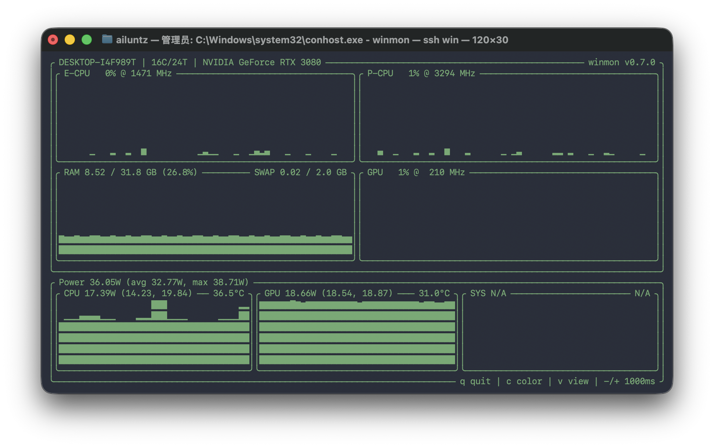

# winmon

`winmon` 是一个给 Windows 用的终端监控工具，聚焦这类机器：

- Windows 10/11 x64
- Intel CPU
- NVIDIA 独显

相关项目：
[Releases](https://github.com/ailuntx/winmon/releases) · [install.ps1](https://github.com/ailuntx/winmon/releases/latest/download/install.ps1) · [mac 版](https://github.com/vladkens/macmon) · linux 版本（GitHub 预留）



> [!IMPORTANT]
> 建议始终以管理员身份启动 Windows Terminal、PowerShell 或 `cmd` 后再运行 `winmon`。
> 不以管理员运行时，温度、功耗和一部分传感器经常会直接没有数据，界面里看到 `N/A` 或空白通常就是这个原因。

默认直接起终端界面，也支持命令模式：

```powershell
winmon
winmon pipe -s 1 --device-info
winmon debug
winmon serve
```

## 安装

最稳的方式还是下载 release 里的 zip，解压后先运行一次 `winmon.exe`。

首次运行后会把稳定副本和运行时写到 `%APPDATA%\winmon`，后面新开的 `cmd` 或 `PowerShell` 可以直接输入：

```powershell
winmon
```

如果 release 对当前账号可访问，也可以直接用脚本安装。

Windows PowerShell 5.1 下更稳的是先落盘再执行：

```powershell
$p = Join-Path $env:TEMP "winmon-install.ps1"
iwr "https://github.com/ailuntx/winmon/releases/latest/download/install.ps1" -UseBasicParsing -OutFile $p
powershell -NoProfile -ExecutionPolicy Bypass -File $p
```

如果当前是在 `cmd` 里，或者是从 macOS 用 `ssh win` 连进去，直接用这两条：

```cmd
curl.exe -L --fail --silent --show-error "https://github.com/ailuntx/winmon/releases/latest/download/install.ps1" -o "%TEMP%\winmon-install.ps1"
powershell -NoProfile -ExecutionPolicy Bypass -File "%TEMP%\winmon-install.ps1"
```

`winget` 清单已经准备好了，可以继续往社区仓库提 PR。

## serve

可以通过 HTTP 暴露当前指标：

```powershell
winmon serve
winmon serve --port 9090
```

可用端点：

- `GET /json`
- `GET /metrics`

仓库里也放了一个 [example-grafana](./example-grafana) 目录，方便直接接 Prometheus / Grafana。

如果 Prometheus 跑在另一台机器上，把 `example-grafana/prometheus.yml` 里的 `192.168.8.16:9090` 改成实际的 `winmon serve` 地址即可。

在当前这套局域网环境里，可以直接：

```bash
cd example-grafana
docker compose up -d
```

默认入口：

- Prometheus: `http://localhost:9091`
- Grafana: `http://localhost:9000`
- Grafana 默认账号: `winmon`
- Grafana 默认密码: `winmon`

## 说明

- 管理员权限几乎是硬要求：不以管理员运行时，温度、功耗和部分负载数据可能直接为空
- 颜色、视图模式、刷新间隔保存在 `%APPDATA%\winmon\config.json`
- CPU 温度和 P/E CPU 传感器依赖内嵌的 `OpenHardwareMonitorLib.dll` 及其运行时依赖
- `sys_power` 当前没有可靠通用来源，长期保持 `N/A`
- 当前发布包使用静态 CRT，不额外依赖 VC++ 运行库

## 许可证

仓库自身代码按 `MIT` 发布。

`third_party` 里的外部文件继续保留它们各自的许可证：

- `OpenHardwareMonitorLib.dll` 和相关运行时依赖见 `third_party/licenses`
- 参考过的 `macmon` 说明和 `MIT` 文本也保留在 `third_party/licenses`
